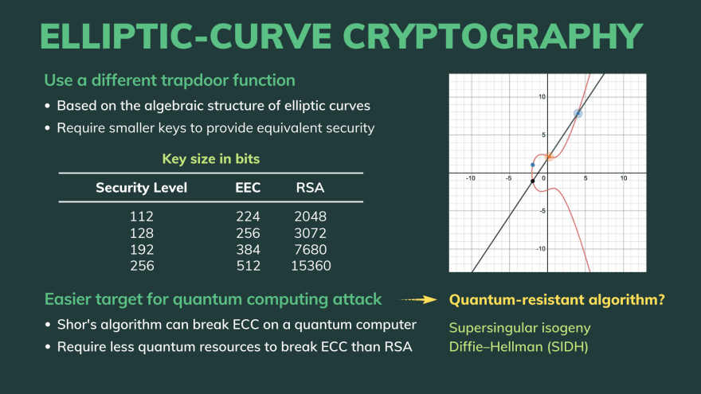
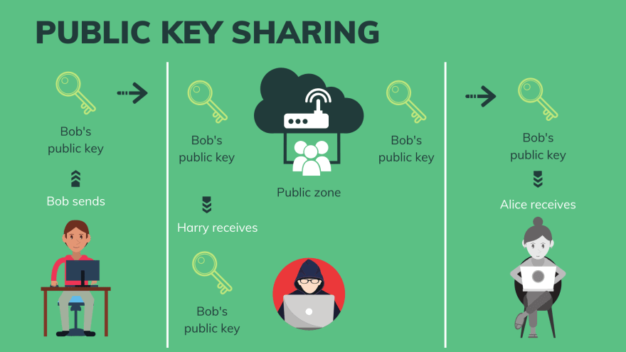
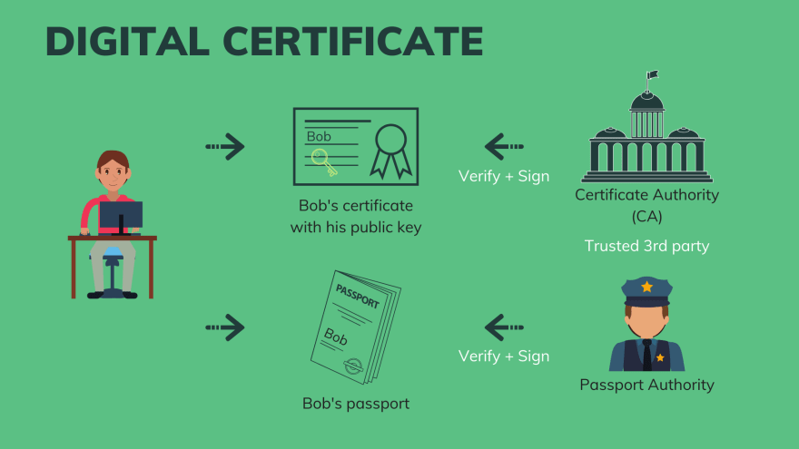
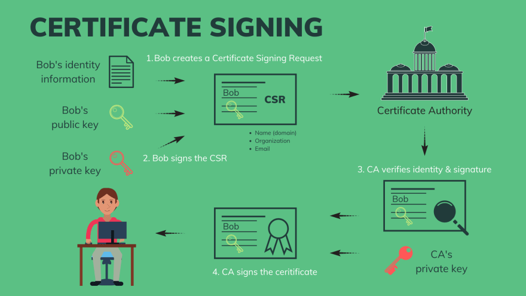
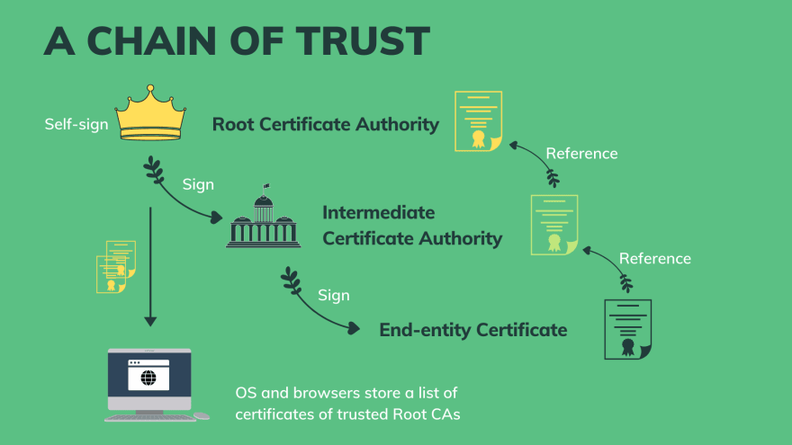
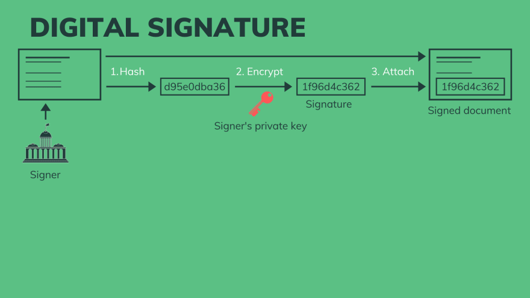

# A complete overview of SSL/TLS and its cryptographic system
I guess many of you who are reading this lecture know about HTTPS and some of 
you may have setup SSL/TLS for you web server. But how many of you understand 
deeply how SSL/TLS works?

Do you know what really happens during a TLS handshake?

Why do we need to handshake?

What cryptographic algorithms are used by TLS to protect the data?

Why do we need digital certificates?

Why does it need to be signed by a certificate authority?

What is a digital signature and how is it generated?

There are a lot of questions, and I don't want to just scratch the surface, so
this is gonna be a very good thorough lecture to tell you everything about 
SSL/TLS, an extremely important building block of the security over the 
internet.

## What is SSL/TLS?
Well, SSL stands for Secure Socket Layer. It is the predecessor of TLS and TLS
the short form of Transport Layer Security, which is a cryptographic protocol 
that provides secure communication over a computer network. Here's a bit of 
the history of SSL and TLS.

## The history of SSL/TLS
SSL was originally developed by Netscape and it was first published in 1995
with version 2.0. SSL version 1.0 was never publicly released because of some
serious security flaws. In 1996, the SSL version 3.0 was published as a 
complete redesign of the protocol. Then 3 years later, TLS 1.0 was first 
defined in RFC 2246 by IETF as an upgrade of SSL Version 3.0. It took 7 
years to upgrade it to TLS 1.1 in 2006. TLS 1.2 came right after that in 2008.
Then finally after 10 years in the making we got TLS 1.3 with a huge 
improvements in 2018. So at the moment, which SSL/TLS version still exists?
Well, the SSL 2.0 was deprecated in 2011, SSL 3.0 was deprecated in 2015 and 
recently in March 2020, TLS 1.0 and TLS  1.1 was also gone. That means only 
TLS 1.2 and 1.3 are still alive.

**Picture 1** - The history of SSL/TLS.

## Where is TLS being used?
OK, so let's see where TLS is being used. First it is widely used on the web. 
All websites that you visit with HTTPS are secured by TLS, or we often say HTTP 
over TLS. Similarly, email with SMTPS protocol is, in fact, SMTP and TLS. Then
FTPS for secure file transfer protocol is also FTP plus TLS. There are many 
other applications of TLS that I don't have enough time to mention.

## Why do we need TLS?
Why is it so important? Because TLS gives us 3 things: 

* first, authentication. TLS verifies the identity of the communicating parties
  which normally be clients and servers. With the help of asymmetric
  cryptography, TLS makes sure that we will go to the authentic website and not
  a fake one.
* second, confidentiality. TLS protects the exchanged data from unauthorized 
  access by encrypting it with symmetric encryption algorithms.
* and third, integrity. TLS recognizes any alteration of data during 
  transmission by checking the message authentication code, which we will 
  learn about in a moment.

## How does TLS work?
Basically, TLS consists of 2 phases, or 2 protocols.
The first one is handshake protocol. In this phase, client and server will 
* negotiate the protocol version,
* select cryptographic algorithm or cipher suites,
* authenticate each other by asymmetric cryptography
* establish a shared secret key that will be used for symmetric encryption in 
  the next phase.
  
So the main purpose of the handshake is for authentication and key exchange.

The second phase is record protocol. In this phase
* all outgoing messages will be encrypted with the shared secret key 
  established in the handshake.
* then the encrypted messages are transmitted to the other side.
* they will be verified to see if there's any modification during transmission 
  or not.
* if not, the messages will be decrypted with the same symmetric secret
  key.
  
So we will achieve both confidentiality and integrity in this record protocol 
and because the amount of encrypted data in this phase is large, this is often 
call bulk encryption.

**Picture 2** - How does TLS Work?

## Why TLS uses both symmetric and asymmetric cryptography?
Why not just use one for all? Well it's easy to see that symmetric cryptography
can't provide authentication since there's only 1 secret key for both client
and server, so they know nothing about each other to verify. Not to mention
that how they come up with the same key without leaking it to the public is 
hard. How about asymmetric cryptography? Sounds like a good candidate. 
Unfortunately, it's much slower than symmetric cryptography. And by "much", I
mean from 100 times to even 10000 times slower. So it's clearly not suitable 
for bulk encryption.

## Symmetric cryptography
Alright, now let's learn more about symmetric cryptography. I guess you've 
already known the basics. First of all, Alice has a plaintext message that she
wants to send to Bob, but doesn't want anyone in the public zone to read it.
So she encrypts the message with a secret key that they have shared with each 
other before. Then she sends the encrypted message to Bob via the public 
internet. Upon receiving the encrypted message, Bob will easily use the same 
secret key to decrypt it. Since the same key is used for encryption and 
decryption, it's kind of symmetric, so we have the name "symmetric 
cryptography". Now there might be a hacker Harry who can catch their exchanged 
message on the public network. However, the message is already encrypted, and
Harry doesn't have the secret key, so he won't be able to decrypt it. But he
can still change it!

**Picture 3** - Symmetric cryptography

### Bit-flipping attack
There's one technique called bit-flipping attack that works like this. Let's 
say this time Alice is not talking to Bob, but talking to her online bank and
she wants to send 100 dollars to someone. The message is encrypted with a 
secret key and sent to the bank via the internet. Now Harry catches the 
encrypted message. Although he can't decrypt it, he can flip some of its bits
from 1 to 0 and from 0 to 1, then forward that modified message to the bank.
Now when the bank decrypts it, they will get a different plaintext content. In
this case, it has become 900 dollars instead of 100. So it's very dangerous.
That's why we need to make sure that the encrypted message hasn't been altered 
during transmission. But how?

**Picture 4** - Bit-flipping attack

### Authenticated Encryption (AE)
One way to do that is to use Authenticated Encryption. The idea is to not just 
encrypt, but also authenticate the encrypted message. The first step is 
encrypt. Alice's plaintext message goes through a symmetric encryption 
algorithm such as AES-256-GCM or CHACHA20. This encryption algorithm also takes
a shared secret key and a random nonce, or an initialization vector (IV) as 
input. It will return the encrypted message. The second step is to 
authenticate. The encrypted message, the secret key and the nonce become 
inputs of a MAC algorithm such as GMAC if you use AES-256-GCM, or POLY1305 if 
you use CHACHA20 encryption algorithm. This MAC algorithm acts like a 
cryptographic hash function and its output is a MAC, or message authentication
code. Now this MAC will be tagged along with the encrypted message and the 
final result will be sent to Bob. Because of this, we sometimes call this MAC
an authentication tag. In TLS 1.3, besides the encrypted message, we also want
to authenticate some associated data, such as the addresses, the ports, the
protocol version, or the sequence number. This information is unencrypted and
known by both communicating parties. So the associated data is also an input
of the MAC algorithm and because of this, the whole process is called 
Authenticated Encryption with Associated Data, or in short AEAD. Now we will
see how Bob can check that the encrypted message hasn't been changed during
transmission. It's simply a reserve process. Starting with encrypted message
with MAC, we untag the MAC from the encrypted message. Then the encrypted 
message will go to the MAC algorithm together with the shared secret key and 
the nonce. Note that this is the same nonce that is used in the encryption 
process. Usually the nonce is padded to the encrypted message before sending 
to the receiver. The associated data will also go into the MAC algorithm and 
the output of it will be another MAC. Now Bob can simply compare the 2 MAC
values. If they're different, then he knows that the encrypted message has been 
changed. Else, he can safely decrypt the message and use it with the confident 
that it's the same plaintext message that Alice sent.

**Picture 5** - Authenticated encryption

**Picture 6** - Decryption and verification

### Secret key exchange
However, there's 1 question: How Bob and Alice share the secret key with each
other without leaking it to the public? Well, the answer is: they need to use 
asymmetric or public-key cryptography for that purpose. Specifically, they can
use either Diffie-Hellman Ephemeral, or Elliptic-Curve Diffie-Hellman 
Ephemeral. 

#### Diffie-Hellman key exchange
OK, let's see how Diffie Hellman key-exchange works! First, Alice 
and Bobs both agree on 2 numbers: the base g and the modulus p. These numbers 
are known publicly by everyone. Then each of them secretly choose a private 
number. Alice's private key is number small `a` and Bob's private key is number
small `b`. Then Alice computes her public key big `A` equals `g` to the power 
of small `a` modulo `p` and sends it to Bob. Similarly, Bob computes his public 
key big `B` equals `g` to the power of small `b` modulo `p` and sends it to 
Alice. Then Alice will receive Bob's public key big `B` and Bob will receive 
Alice's public key big `A`. Now the magic happens. Alice computes big `B` to 
the power of small `a mod p`, Bob computes big A to the power of small 
`b mod p` and these 2 values magically equal to the same number `S`. Why? 
Because if you do the math, they both equal to `g` to the power of `a` multiply
`b` mod `p`. So Alice and Bob come up with the same secret number S without 
leaking it to the public.

**Picture 7** - Diffie-Hellman key exchange

#### Key Derivation Function - KDF
However, keep in mind that each encryption algorithm may require a secret key
of different length. So to make the secret key Alice and Bob must put `S` to the 
same key derivation function. The output will be a shared secret key of
required length. In TLS 1.3 we use a HMAC-based key derivation function, so 
that's why the name HKDF. Let's learn a bit more about this key derivation 
function. Generally, the KDF takes an input key material or IKM. In our case,
the IKM is the number `S`. We need to tell the KDF how long we want the output
key to be, such as 128-bit. Then the KDF also needs a cryptographic hash 
function, such as HMAC-SHA256 and optionally some context or 
application-specific information and a salt. With all of these inputs, KDF will
produce a secret key of required length.

**Picture 8** - Key Derivation Function

#### Trapdoor function
Now get back to the Diffie-Hellman key exchange. We know that `p`, `g`, big `A`
and big `B` are known to the public, which means the hacker, Harry, also has 
access to those numbers. We may wonder: Is this key exchange mechanism secure?
Or given `p`, `g`, big `A` and big `B` computed by these functions, can Harry 
figure out the secret numbers: small `a`, small `b`, and `S`? Fortunately, 
these functions will become trapdoors if we choose good values for `p`, `g`, 
small `a` and small `b`. For example: choose `p` as a 2048-bit prime number, 
choose `g` as a primitive root modulo `p`, and choose small `a` and small `b` 
to be 256-bit random integers. A trapdoor function basically means it's easy to 
compute in one way but hard in the other. In this case, given `p`, `g` and 
small `a`, it's easy to compute big `A`. But given `p`, `g` and big `A`, it's 
very hard to compute small `a`. It's easy to see that big `A` can be computed 
pretty fast with `O(log(a))` time complexity. It's well-known modular 
exponentiation problem. Computing smaller `a`, on the other hand is much 
harder. It's a discrete logarithm problem which takes our current-generation 
of computers a very long time to solve. So we're at least safe for now, or 
until the next generation of strong quantum-computers comes into play. However,
for now, "a long time to solve" doesn't mean unsolvable, right?

**Picture 9** - Trapdoor function

#### Static or Ephemeral key?
If Alice and Bob use the same private keys, smaller `a` and smaller `b`
for every sessions, that they communicate, then what happens is Harry can 
record all of those sessions, and start solving for small `a` from the 
session 1. Although it will take him a long time to solve it, let's say after
session `N`, he get the right small `a`. Now he can use it to compute the 
secret number `S`, and thus he would be able to decrypt all of the recorded 
conversations.  Does it sound scary? How can we prevent it? The answer is 
ephemeral key. As the name may suggest, we use different private key on each
session. So even if Harry can solve the secret key for 1 session, he could not
use it for other ones. This is called perfect forward secrecy in TLS. So now 
you understand what Diffie-Hellman Ephemeral means. It's just Diffie-Hellman
with ephemeral or short-lived keys. How about Elliptic-Curve Diffie-Hellman
Ephemeral?

**Picture 10** - Static key.

**Picture 11** - Ephemeral key.

## Elliptic-Curve Cryptography
Well, Elliptic-curve cryptography (or ECC) is an approach to 
asymmetric cryptography, where the algorithm is similar, but a different 
trapdoor function is used. That trapdoor function is based on the algebraic 
structure of elliptic curves and that's why the name. One amazing value of 
elliptic curve cryptography is it requires smaller keys to provide the 
equivalent security level. You can see it in this comparison table with RSA. 
The U.S. National Security Agency (NSA) used to protect their top secret with
ECC 384 bits key, which provides the same security level with a RSA 7680 bit 
key. Sounds amazing, right? However, Elliptic curve cryptography is an easier
target for quantum-computing attack. [Shor's algorithm](https://en.wikipedia.org/wiki/Shor%27s_algorithm) can break ECC on a
hypothetical quantum computer with less amount of quantum resources than to 
break RSA. There might be decades before that strong quantum computer actually
be built and used, but have we prepared anything for that yet? Is there any 
quantum-resistant algorithm? Yes, there is 
[Supersingular Isogeny Diffie-Hellman](https://en.wikipedia.org/wiki/Supersingular_isogeny_key_exchange)
key exchange algorithm, which is also based on the Elliptic Curve Cryptography.
But that's another story though.

**Picture 12** - Elliptic-Curve Cryptography.

## Asymmetric cryptography
Now let's get back to asymmetric cryptography. It's an awesome technology that
has a wide range of applications. We've already explored 1 of its application,
which is for symmetric secret key exchange, with Diffie-Hellman Ephemeral and
Elliptic-Curve Diffie-Hellman Ephemeral. In fact, RSA algorithm was also used
for key exchange in the past, but it has been removed in TLS 1.3 due to various
attacks and no forward-secrecy capability. Asymmetric cryptography is also used
in encryption system. Here are asymmetric encryption algorithms:
* RSA with optimal asymmetric encryption padding RSA 
* RSA with public key cryptography standard 1
* Elgamal encryption algorithm
  
And finally, another important feature of asymmetric cryptography is for 
digital signature which TLS uses extensively for authentication. Some popular 
digital signature algorithms used in TLS are:
* RSA with Probabilistic Signature Scheme,
* Elliptic-Curve Digital Signature Algorithm,
* Edwards-Curve Digital Signature Algorithm.
  
We will learn about digital signature shortly, but before that, let's learn 
how asymmetric encryption system works. 

**Picture 13** - Asymmetric cryptography.

## Asymmetric Encryption
Similar as in symmetric encryption, Alice has a plaintext message that she 
wants to send to Bob. But this time, there's no shared secret key. Instead, 
Alice encrypt the mesage with Bob's public key and send the encrypted message
to Bob. When Bob receives the message, he uses his private key to decrypt it.
Although the public key and private key are different they are still connected
by some trapdoor function, just like what we've seen in the Diffie-Hellman 
algorithm. The idea is: keys come in pair, and only the private key of the 
same pair can decrypt the message encrypted with its public key. Because of 
this, even when Harry the hacker has access to both Alice's encrypted message
and Bob's public key, he cannot use that public key to decrypt the message.

**Picture 14** - Asymmetric encryption.

Therefore, the public key sharing become very simple. Bob just send the key
to Alice directly over the public internet without the fear that the key can
be used to decrypt any messages. The key is public, so anyone can use it to
encrypt messages that only Bob can read, even if they have never talked to each
other before. It's really mind-blowing, isn't it? However, life's not that so
easy.

**Picture 15** - Public key sharing.

Although we know that Harry cannot decrypt the message with Bob's public key he
can still interfere with the public key sharing and replace Bob's public key 
with his own public key. Now when Alice receive the key she still thinks it's 
Bob's public key, but it's in fact Harry's. So if Alice encrypts her message
with this key, Harry would be able to decrypt it with his private key. The 
reason this can happen is because a key is simply just a number and there's no
identity information to tell us who its owner is. So what can we do? Obviously,
we should put the key together with some identity information. That's nothing
else but a digital certificate. 

**Picture 16** - Man-in-the-middle attack.

## Digital certificate
So Bob puts his key inside his certificate, which has his name and other 
identity information on it. The certificate acts like a passport in the real 
world. But how do we know it's really Bob who owns that certificate? What 
stops Harry from making a fake certificate under Bob's name but with Harry's
public key? Well, just like in the real world, the passport must be issued by
a passport authority after a process of identity verification. In digital 
world, the certificate must be verified and signed by a certificate authority. 
This certificate authority and passport authority are trusted third party who
helps us prevent creation of fake passport and digital certificates.

**Picture 17** - Certificate signing.

The certificate signing process happens like this: Bob has a pair of public and 
private key. In the first step, he creates a certificate signing request, or
CSR. This CSR contains his public key and some identity information such as his
name, organization and email. Then the second step, he signs the CSR with his 
private key and sends it to the certificate authority. The certificate 
authority will verify Bob's identity in the certificate. They can contact him
to ask for more proof if necessary. Then they use Bob's public key in the 
certificate to verify his signature. This is to make sure that Bob really owns
the private key that paired with the public key in the certificate. If 
everything is valid, the CA will sign the certificate with their own private 
key and send it back to Bob.

### Certificate sharing
Now Bob will share with Alice this certificate, which contains his public key, 
instead of sending just the public key as before. Upon receiving the 
certificate, Alice can easily verify its authenticity with the public key of 
the Certificate authority. Because of this, Harry cannot replace Bob's public 
key with his key anymore. Since he doesn't have the CA's private key to sign 
the fake certificate. Note that this only works because we all trust the 
Certificate Authority. If somehow the CA is not trustworthy, for example, if 
they give Harry their private key, then we're in a serious trouble!

**Picture 18** - Certificate sharing.

## Certificate Authority - A chain of trust
In reality, there's a chain of certificate authorities where at the top level
is a root certificate authority, who signs their own certificate, and also 
signs the certificate of their subordinate, which is an intermediate 
certificate authority. This authority can sign the certificate of other 
intermediate authorities, or they can sign the end-entity certificate (of leaf
certificate). Each certificate will reference back to the certificate of their
higher level authority up to the root. Your operating systems and browsers
store a list of certificates of trusted root certificate authorities. That way 
they can easily verify the authenticity of all certificates. OK, let's check 
out a real TLS certificate of Youtube! On Chrome, we click this lock button and
choose Certificate. This is the end-entity certificate. It was issued by Google
Trust Services (GTS) with the signature algorithm is RSA with SHA-256 hash 
algorithm. The certificate's public key uses Elliptic Curve cryptography with
key size is 256 bit. So the key looks quite short and this is its signature 
below, signed by GTS. If we scroll down a bit, we can see that this 
certificate is used for many Google's websites, including youtube.com and it 
has an expiry date. Now let's look at the certificate of the 
authority who signs this certificate. It's an intermediate certificate 
authority and its name is Google Trust Services. It also has a public key, but
with different type: RSA encryption. Therefore, the key is much bigger: 2048 
bits, and it has signature, signed by the root authority. The root certificate
authority is GlobalSign and it has a self-signed signature.

**Picture 19** - A chain of trust.

## Digital signature
We've talked a lot about digital signature, so let's see how it really works! 
To sign a document, the signer first need to hash it, then the hash value is
encrypted, using the signer's private key. The result will be the digital 
signature. Then this signature will be attached to the original document and 
that's it for the signing process. Now how can we verify that the signature
is valid? Well, we just do a reversed process. First we detach the signature
from the document, decrypt it with the signer's public key to get a hash value.
Then we hash the document with the same hash algorithm used in the signing 
process. The result is another hash value. Then we just compare the 2 hash
values. If they're the same then the signature is valid.

**Picture 20** - Digital signature.

## TLS 1.3 handshake protocol
OK, so now with all the knowledge we've gained so far, let's take a closer look
at how they're used in the TLS handshake protocol.

The TLS 1.3 full handshake starts with a hello message that the client sends to
the server. Actually this message contains a lot of things, but here I just 
list some important information. 

First a list of protocol version that client supports. Then a list of 
supported AEAD symmetric cipher suites. In this case, there are 2 options: 
AES-256-GCM or CHACHA20-POLY1305. After that, there's a list of supported key
exchange groups. For example, this client supports both finite field 
Diffie-Hellman Ephemeral and Elliptic-Curve Diffie-Hellman Ephemeral. That's
why client also shares its 2 public keys. One for Diffie-Hellman and the 
other for elliptic-curve Diffie-Hellman. This way the server will be able to
compute the shared secret key no mater what algorithm it chooses. The last 
field client sends in this message is a list of signature algorithms it 
supports. This is for server to choose which algorithm it should use to sign
the whole handshake. We will see how it works in a bit.

**Picture 21** - TLS 1.3 full handshake (client hello message).

After receiving the client hello message, the server also sends back its hello
message, which contains the selected protocol version TLS 1.3, the selected 
cipher suites: AES-256-GCM, the selected key exchange method: Diffie-Hellman
Ephemeral and the server's public key for that chosen method. The next field
is a request for the client's certificate, which is optional and will only be
sent if the server wants to authenticate the client by its certificate. 
Normally on a HTTPS website only the server side needs to send its certificate 
to the client. That is sent in the next field of this message.

**Picture 22** - TLS 1.3 full handshake (server sends back its hello message).

The next field is certificate verify, which is, in fact, the signature of the 
entire handshake up to this point. Here's how it is generated: The whole data
from the beginning of the handshake up to the certificate request is called a
handshake context. We concatenate this context with the server's certificate,
hash it and sign the hash value with the server's private key using 1 of the
signature algorithms that the client supports. In a similar fashion, the 
server finish is generated by concatenating the handshake context, the 
certificate, and the certificate verify, hash it and put the hash value through
the MAC algorithm of the chosen cipher suite. The result is the MAC of the 
entire handshake.

Here the server certificate, certificate verify, and server finish are called
authentication messages, because they are used to authenticate the server. With
the signature and MAC of the entire handshake TLS 1.3 is safe against several
types of man-in-the-middle Downgrade attacks.

**Picture 23** - TLS 1.3 full handshake (authentication message).

Now after the client receives the hello message from server, it will validate 
the server's certificate with the root authority and check the signature and 
MAC of the entire handshake to make sure it's not been tampered with. If 
everything is good then the client sends its finish message with the MAC of the
entire handshake up to this point, and optionally the client's certificate and 
certificate verify in case the server has requested. 

That's the whole flow of the full TLS handshake.

**Picture 24** - TLS 1.3 full handshake (whole flow).

## Abbreviated handshake with PSK resumption
To improve the performance, the client and server don't always go through this
full handshake. Sometimes, they perform abbreviated handshake by using 
preshared key resumption. The idea is: after the previous handshake, the client
and server already know each other, so they don't need to authenticate again. 
So the server may send one or multiple session tickets to the client which can 
be used as the pre-shared key (PSK) identity in the next handshake. And it goes
with a ticket lifetime as well as some other information.

**Picture 25** - Resumption & pre-shared key.

Now in the next handshake, the client will send a simple hello message, which 
contains a list of PSK identities (or tickets) obtained from the previous 
handshake, a PSK key exchange mode, which can be either PSK only, or PSK with 
Diffie-Hellman. If the PSK with Diffie-Hellman mode is used, then the client 
also needs to share its Diffie-Hellman public key. This will provide perfect 
forward secrecy, as well as allow the server to fallback to full handshake if 
needed. When the server receives this client hello message, it sends back its 
hello with the selected pre-shared key identity. The optional Diffie-Hellman
public key of the server, and the server finish just like in the full 
handshake. Finally, the client sends back its Finish, and that's the end of 
the PSK resumption. As you can see, there's no certificate authentication 
between client and server in this abbreviated handshake. This is also opens 
up an opportunity for zero round-trip time data which means the client doesn't 
need to wait for the handshake to complete to send its first application data 
to the server.

## 0-RTT handshake
In 0-RTT, client sends the application data together with the client hello 
message. This data is encrypted using the key derived from the first PSK in the
ticket list and it also adds 1 more field: early data indication to tell the 
server that there's early application data being sent along. If the server 
accepts this 0-RTT request it will sends back the server hello just like in the
normal PSK resumption and optionally some application data as well. The client 
will finish with a message containing the MAC, and an end-of-early-data 
indicator. So that's how 0 round trip time works in TLS 1.3. Its pros is reduce
the latency by 1 round trip time. But the cons is openning up a potential threat
of replay attack. Which means, the hacker can just copy and send the same
encrypted 0-RTT request to the server multiple times. To avoid this, the server
application must be implemented in a way that's resilient to duplicate 
requests.

**Picture 26** - 0-RTT handshake.

## Compare TLS 1.3 vs TLS 1.2
Now before we finish let's do a quick comparison of TLS 1.3 and TLS 1.2 to see 
what's new. First TLS 1.3 has safer key exchange mechanisms where  
the vulnerable RSA and other static key exchange methods are removed. Leaving
only ephemeral Diffie-Hellman or Elliptic-Curve Diffie-Hellman remain. 
Therefore achieved perfect forward secrecy. Second, TLS 1.3 handshake is at
least 1 round-trip faster than TLS 1.2. Symmetric encryption in TLS 1.3 is more
secure because AEAD cipher suite is mandatory and it also removes some weak
algorithms from the list such as Block Cipher Mode, RC4, or Triple DES. The 
cipher suite in TLS 1.3 is also simpler, since it only contains th AEAD 
algorithm and a hash algorithm. The key exchange and signature algorithms are
moved to separate fields. While in TLS 1.2, they're merged into the cipher 
suite. As we can see in this example. DHE is key exchange, and RSA is signature
algorithm. This makes the number of recommended cipher suites become too big, 
37 options in TLS 1.2 if I remember correctly. While in TLS 1.3, there are 
only 5. Next, TLS 1.3 also give us stronger signature, since it signs the 
entire handshake not just cover some part of it as in TLS 1.2. Last but not 
least, elliptic-curve cryptography gets a significant attention in TLS 1.3 with
some better curves algorithm added such as Edward-curve digital signature 
algorithm, which is faster without sacrificing security.

**Picture 27** - TLS 1.3 vs TLS 1.2.

And that's everything I want to share with you in this lecture. Thanks for 
reading, and I'll catch you guys in the next one.